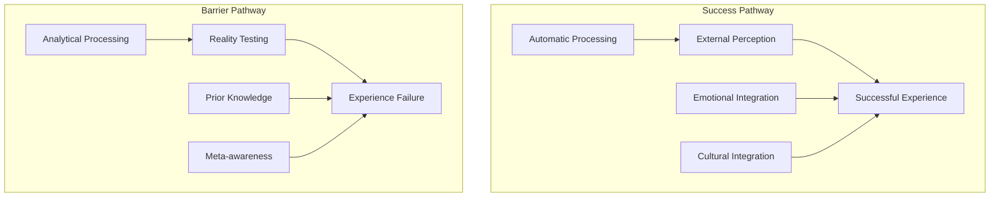
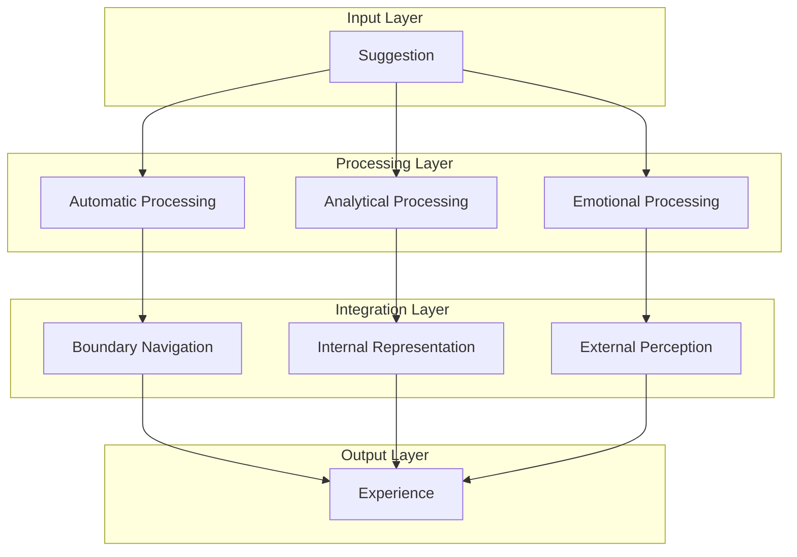
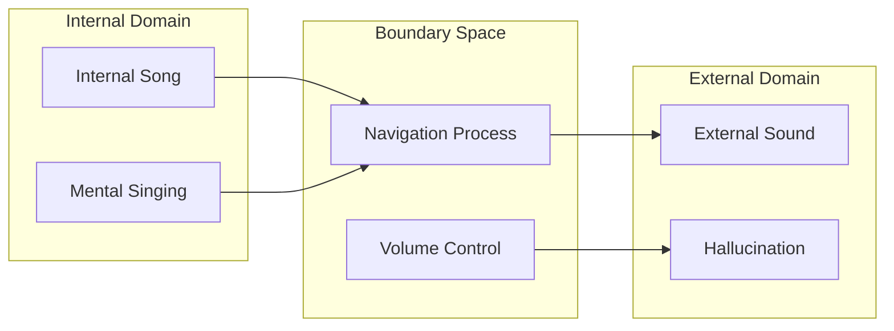
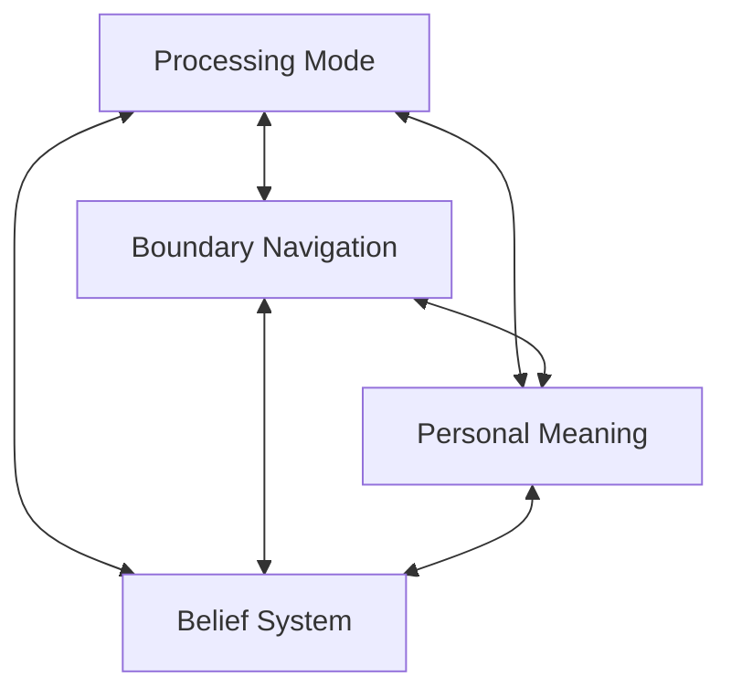

# Visualizations - Auditory Hallucination Analysis

## 1. Response Score Distribution
```
Participant Response Scores (0-5 scale)
┌────────────────────────────────────────┐
P6  █████  5/5
P4  ████   4/5
P1  █      1/5
P2  ░      0/5
P3  ░      0/5
P5  ░      0/5
P7  ░      0/5
└────────────────────────────────────────┘
Legend: █ = 1 point, ░ = no response
```

## 2. Processing Mode Interaction


## 3. Experience Component Heatmap
```
Component Presence Across Participants
           P1  P2  P3  P4  P5  P6  P7
External   ░   ░   ░   █   ░   █   ░
Internal   █   █   █   █   █   █   █
Volume     █   ░   █   █   █   █   ░
Emotion    ░   ░   ░   █   ░   █   ░
Visual     ░   █   █   ░   █   ░   ░
Analysis   █   █   █   ░   █   ░   █
Memory     ░   ░   ░   █   ░   █   ░

Legend: █ = Present, ░ = Absent
```

## 4. Success Factor Impact
```
Factor Impact on Auditory Hallucination
┌────────────────────────────────────────┐
│ Automatic Process  ████████████  High  │
│ Emotion/Memory     ████████      Med   │
│ Cultural Context   ███████       Med   │
│ Visual Imagery     ██            Low   │
│ Analysis          ░░░░          Neg   │
└────────────────────────────────────────┘
```

## 5. Experience Generation Model


## 6. Individual Response Profiles
```
P4 (High Responder)
├── Automaticity:   ████████░░ 80%
├── Emotion/Memory: ████████░░ 80%
├── Reality Test:   ██░░░░░░░░ 20%
└── Analysis:       █░░░░░░░░░ 10%

P7 (Low Responder)
├── Automaticity:   █░░░░░░░░░ 10%
├── Emotion/Memory: ░░░░░░░░░░ 0%
├── Reality Test:   ████████░░ 80%
└── Analysis:       █████████░ 90%
```

## 7. Boundary Navigation Model


## 8. Processing Style Distribution
```
                    Processing Style Spectrum
Analytical ←───────────────────────────────→ Experiential
    P7  P5  P3  P2  P1        P4  P6
```

## 9. Theme Interaction Web


## 10. Success Pathway Timeline
```
Time →
Pre-suggestion     During              Post-suggestion
│                 │                   │
├─Expectation     ├─Auto Processing   ├─Integration
├─Prior Knowledge ├─Boundary Nav      ├─Reality Test
├─Preparation     ├─Memory/Emotion    ├─Reflection
```

## Implementation Notes

1. **Software Requirements**
   - Mermaid.js for flow diagrams
   - D3.js for interactive visualizations
   - Basic HTML/CSS for static displays

2. **Color Scheme**
   - Success: #2ECC71 (Green)
   - Failure: #E74C3C (Red)
   - Process: #3498DB (Blue)
   - Neutral: #95A5A6 (Gray)
   - Background: #ECF0F1 (Light Gray)

3. **Interactive Features**
   - Clickable nodes showing participant quotes
   - Hoverable elements with detailed data
   - Filterable displays by success level
   - Zoomable process diagrams

4. **Accessibility Considerations**
   - High contrast options
   - Pattern alternatives to color
   - Text descriptions
   - Keyboard navigation

Let me know if you'd like me to expand on any of these visualizations or create additional ones for specific aspects of the analysis. 