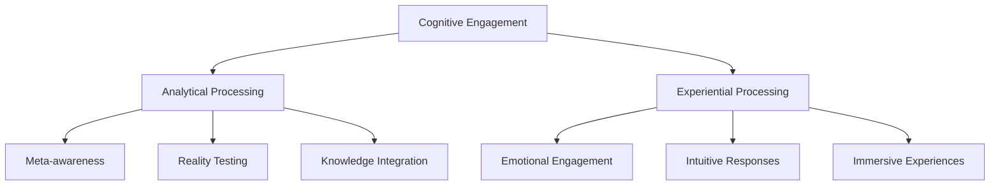
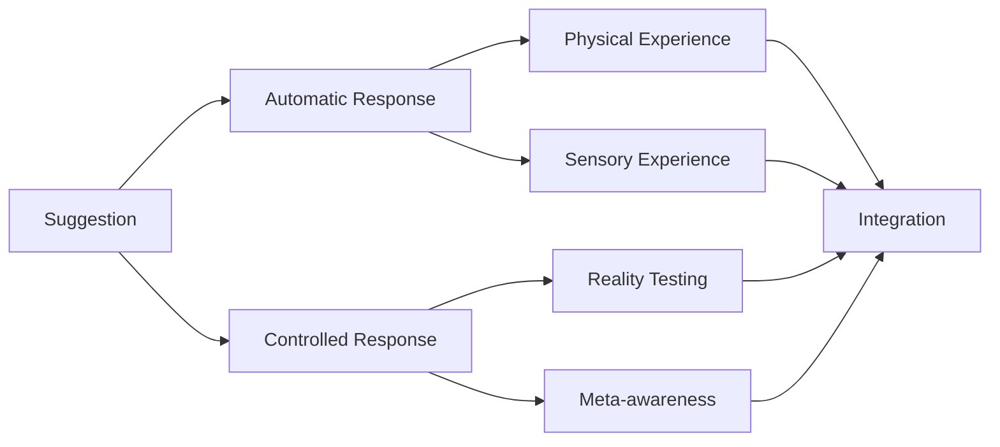
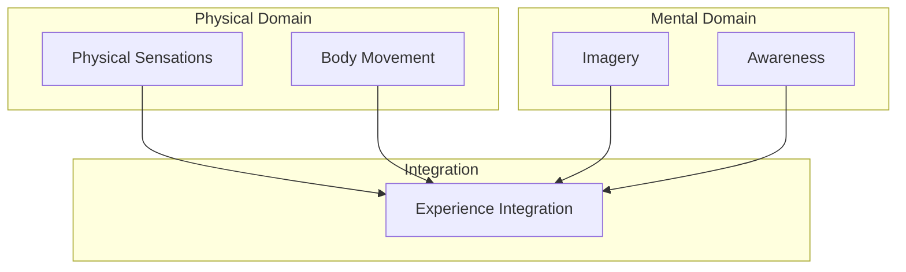
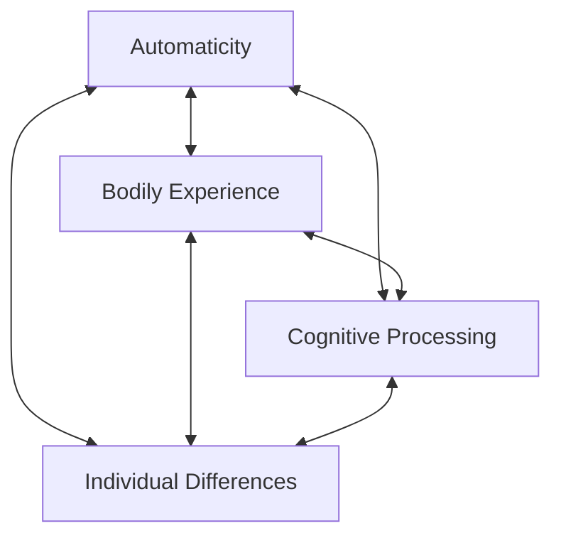

# Thematic Analysis Visualizations

## 1. Theme Network Diagram


## 2. Response Pattern Heatmap
```
Participant  Hand Movement  Hands Stuck  Auditory
P1           ████          ████         ██
P2           ████          █           ░░
P3           ██            █           ░░
P4           █████         ████        ████
P5           ████          ███         ░░
P6           ████          █████       █████
P7           ██            █           ░░

Legend: █ = 1 point on 0-5 scale
```

## 3. Processing Style Distribution
```
                    Processing Style Spectrum
Analytical ←───────────────────────────────→ Experiential
    P7  P3  P1     P2  P5       P6  P4
```

## 4. Theme Prevalence Pie Chart
```
Theme Distribution Across All Sessions
┌────────────────────────────────────┐
│   Automaticity     ███████ 35%     │
│   Sensory          ████   20%      │
│   Cognitive        ████   20%      │
│   Individual Diff  ███    15%      │
│   Reality-Fantasy  ██     10%      │
└────────────────────────────────────┘
```

## 5. Response Type Flow Diagram


## 6. Individual Response Profiles
```
P4 Profile (High Responder)
├── Automaticity: ████████░░ 80%
├── Sensory Int.: ███████░░░ 70%
├── Emotional:    ████████░░ 80%
└── Analysis:     ██░░░░░░░░ 20%

P7 Profile (Low Responder)
├── Automaticity: ██░░░░░░░░ 20%
├── Sensory Int.: ███░░░░░░░ 30%
├── Emotional:    █░░░░░░░░░ 10%
└── Analysis:     ████████░░ 80%
```

## 7. Experience Integration Model


## 8. Suggestion Success Factors
```
Factor Impact on Suggestion Success
┌────────────────────────────────────────┐
│ Low Analysis     ████████████  High    │
│ Automaticity     ███████████   High    │
│ Physical Anchor  ████████      Medium  │
│ Prior Knowledge  ██████        Medium  │
│ Emotion         ████          Low     │
└────────────────────────────────────────┘
```

## 9. Theme Interaction Web


## 10. Response Development Timeline
```
Time →
Pre-suggestion     During              Post-suggestion
│                 │                   │
├─Expectations    ├─Initial Response  ├─Integration
├─Prior Knowledge ├─Development       ├─Reflection
├─Preparation     ├─Peak Experience   ├─Analysis
```

## Implementation Notes

1. **Software Requirements**
   - Mermaid.js for flow diagrams
   - D3.js for interactive visualizations
   - Basic HTML/CSS for static displays

2. **Color Scheme Suggestion**
   - Primary: #2C3E50 (Dark Blue)
   - Secondary: #E74C3C (Red)
   - Tertiary: #3498DB (Light Blue)
   - Accent: #F1C40F (Yellow)
   - Background: #ECF0F1 (Light Gray)

3. **Interactive Features**
   - Hoverable elements showing detailed data
   - Clickable nodes for expanded information
   - Zoomable network diagrams
   - Filterable displays by participant/theme

4. **Accessibility Considerations**
   - High contrast options
   - Pattern alternatives to color coding
   - Text descriptions of visual elements
   - Keyboard navigation support

Let me know if you'd like me to expand on any of these visualizations or create additional ones for specific aspects of the analysis. 